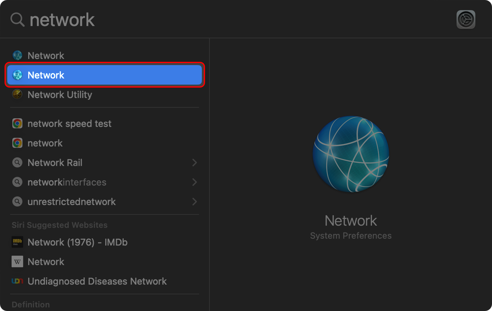
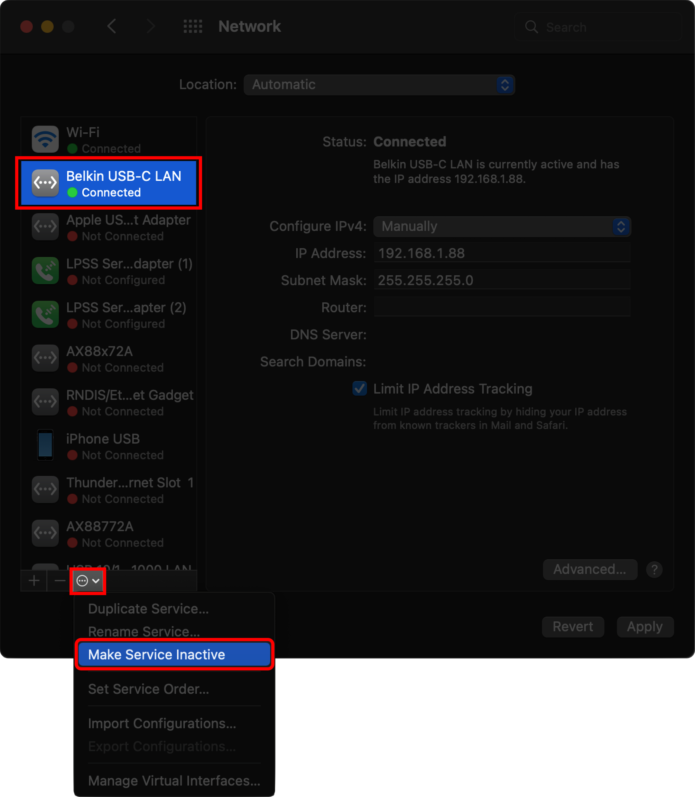

# TouchDesigner Initial Setup for `v2022.26590`

In TouchDesigner `v2022.26590`, it is not possible to select a specific Network Adapter of your PC to choose to listen for PSN traffic in TouchDesigner. 
However, the developers of TouchDesigner have changed this in `v2022.28040`. 
If you are still using TouchDesigner `v2022.26590` or below, you will need to disable all network adaptors except the one you are expecting the PSN traffic from.

## On Windows
1. Open `Network Connections` by clicking on Start (Windows Icon) and type `View Network Connections`.

    

2. Select the network interface that is not expected to receive PSN traffic, right-click and choose `Disable`. 
Do this for all the network interfaces except for the one that is expected to receive PSN traffic.

# On macOS
1. Open Spotlight and type "*Network*"
2. Choose "*Network*" under System Preferences.

    

3. Select the network interface that it not expected to receive PSN traffic, click on action pop-up menu  at the botom.
4. Choose `Make Service Inactive`. 
Do this for all the network interfaces except for the one that is expected to receive PSN traffic.

    

5. You can now proceed to follow the remaining steps described in [Audio Documentation](./zt_Audio.md/#touchdesigner-setup)
# Resources

* [TD Forum Post](resources/PSN_CHOP_Interface_dev_comment.png).
* [Link to Touch Designer Forum](https://forum.derivative.ca/t/posinet-chop-artnet-cant-receive-data-simultaneous/150683/9?u=lukechikkala)