# zactrack :: Audio
**[zacTrack Documentation](../README.md) `>` [zacTrack with Audio](zt_Audio.md)**

# Index
* [Introduction](#introduction)
* [Goal](#goal)
* [Requirements](#requirements)
* [Software Versions](#software-versions)
* [zactrack PSN [PosiStageNet] Setup](#zactrack-psn-posistagenet-setup)
* [TouchDesigner Setup](#touchdesigner-setup)
	* [Audio Setup](#audio-setup)
	* [PSN Setup](#psn-setup)
	* [Connecting Audio & PSN](#connecting-audio--psn)

# Introduction

TouchDesigner is a node-based software that allows for creating some interaction between several protocols.<br>
It is mainly used for visual interactions but in our case we are going to use it to get the XYZ data provided by zactrack over PSN to modify the PAN & Volume.<br>

# Goal
The idea is to play audio files from PC/Mac and pan the audio left or right based on zactrack's tracker position.

# Requirements
1. zactrack System
2. PC or Mac running [TouchDesigner](https://derivative.ca/UserGuide/Install_TouchDesigner).
3. [Virtual VB Audio Cable (for Windows only)](https://vb-audio.com/Cable/#:~:text=%C2%A0%C2%A0VBCABLE_Driver_Pack43.zip%0A%C2%A0%C2%A0(1.09%20MB%20%2D%20OCT%202015%20/%20XP%20to%20WIN11%2032/64%20bits))
4. `<macOS equivalent software here>` (for macOS only)
5. Stereo System
6. Audio Card (optional to connect Speakers to the PC/Mac)

# Software Versions
```
• zactrack      | v3.19.3.0
• TouchDesigner | v2022.28040
• Windows 10    | 21H1, Build: 19043.1889
• macOS         | <macos_version>
```

# zactrack PSN [PosiStageNet] Setup
This documentation assumes the system is already calibrated.<br>
To know more about System Calibration, visit [here](../Setup/zt_Setup.md/#calibration).

1. Ensure atleast one Actor/Tracker is added.
2. Go to `Show Editor` → `Fixture Types`.
3. Click on green plus icon [**➕**].
4. Go to `Other Protocols` tab and select `PosiStageNet (PSN)`.
<p align="center">
	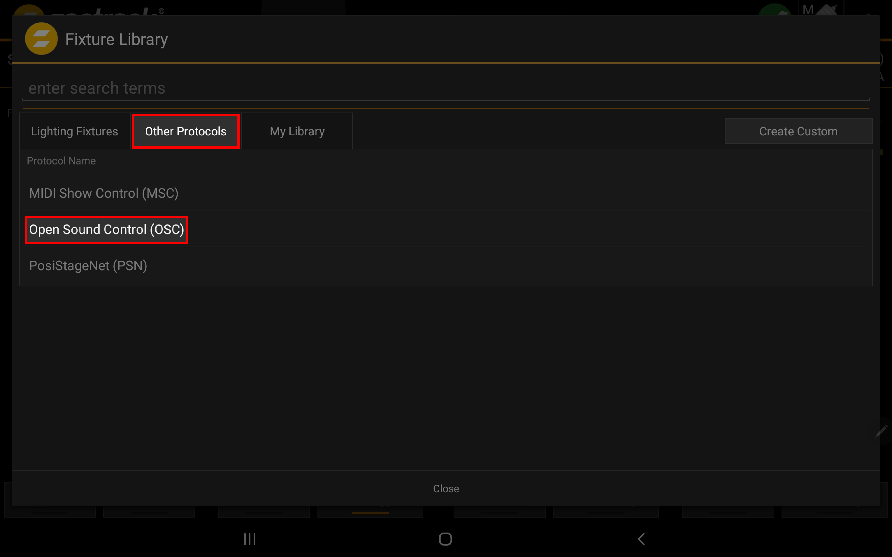
</p>

5. Go to `Show Editor` → `Fixtures`.
6. Click on green plus icon [**➕**].
7. Click on `Fixture Type` and choose `PosiStageNet (PSN)`.
<p align="center">
	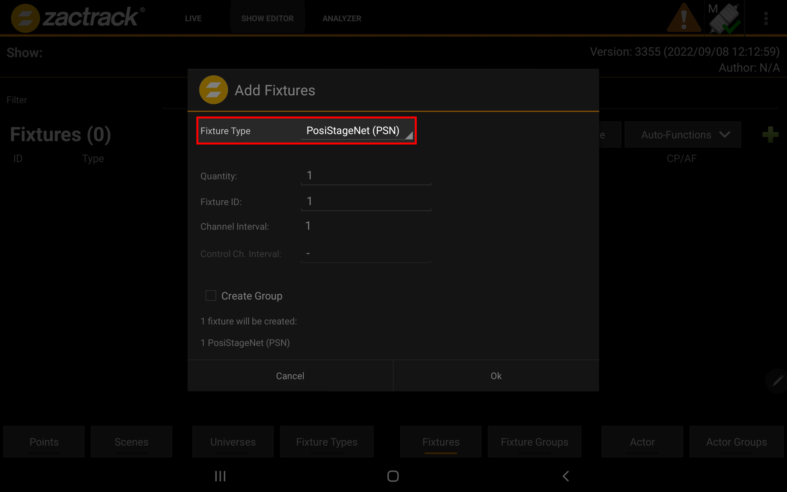
</p>

8. Perform a `Show Upload` by clicking on the alert icon on the top-right corner of the screen and choosing `Upload to Server`.
9. Go to `Live` → `Fixtures` → `PosiStageNet(PSN)`.
<p align="center">
	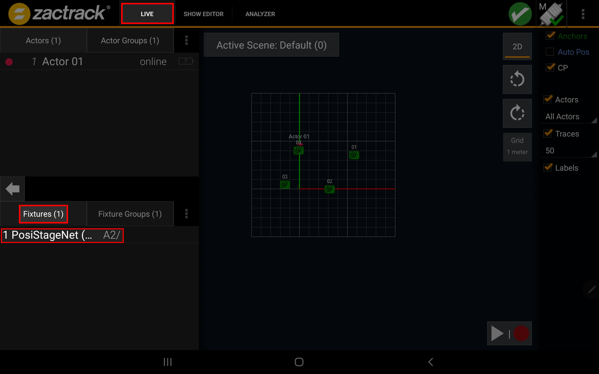
</p>

10. Uncheck `Console`, select `Assignment` and choose one of the Actors you added.
<p align="center">
	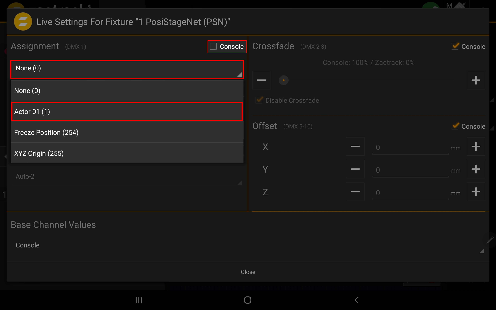
</p>

# TouchDesigner Setup
If you are using TouchDesigner `v2022.26590` or older, follow the guide [here](TouchDesigner_Setup_v2022.26590.md) to do the initial setup.
If you are using TouchDesigner `v2022.28040` or newer, proceed to the following steps.
1. Open TouchDesigner.<br>
It comes with some existing nodes, but we take a new file.
2. `File` → `New`<br>
The application will restart and we will have a new project.
3. We will first need to ensure that the Audio is being routed through TouchDesigner.<br>
Usually, the Audio Routing in our PC is something like this:
<p align="center">
	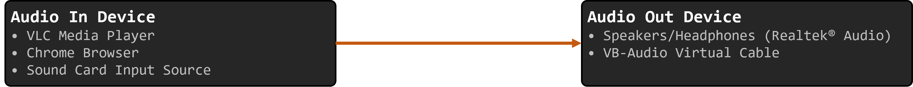
</p>
We now need to route it via TouchDesigner and it would look something like this:<br>
<p align="center">
	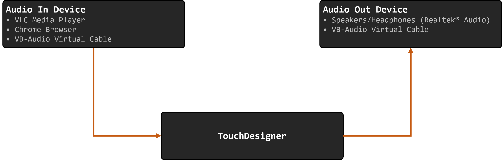
</p>

## Audio Setup
1. To achieve this, we will now add a new operator (aka 'node'):<br>
double-clicking on the empty grid area (we call this area as *Network Editor*)<br>
or<br>
hit `Tab` on the keyboard<br>
or<br>
right-click and and select `Add Operator`.
2. Head over to the `CHOP` tab and select `Audio Device In`.
<p align="center">
	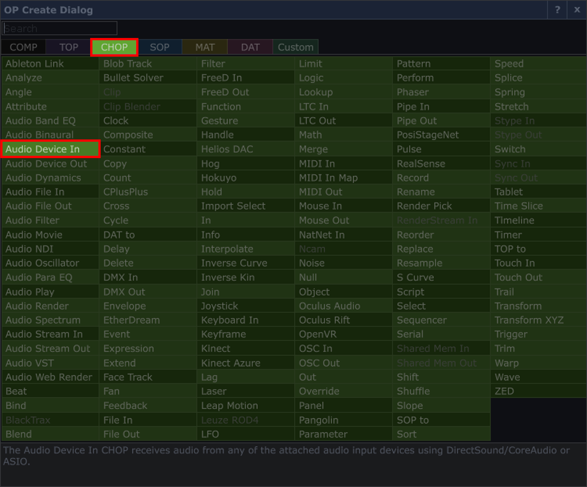
</p>

3. This should then add an Audio Device In CHOP on our Network Editor ("grid").<br>
It would look something like this:
<p align="center">
	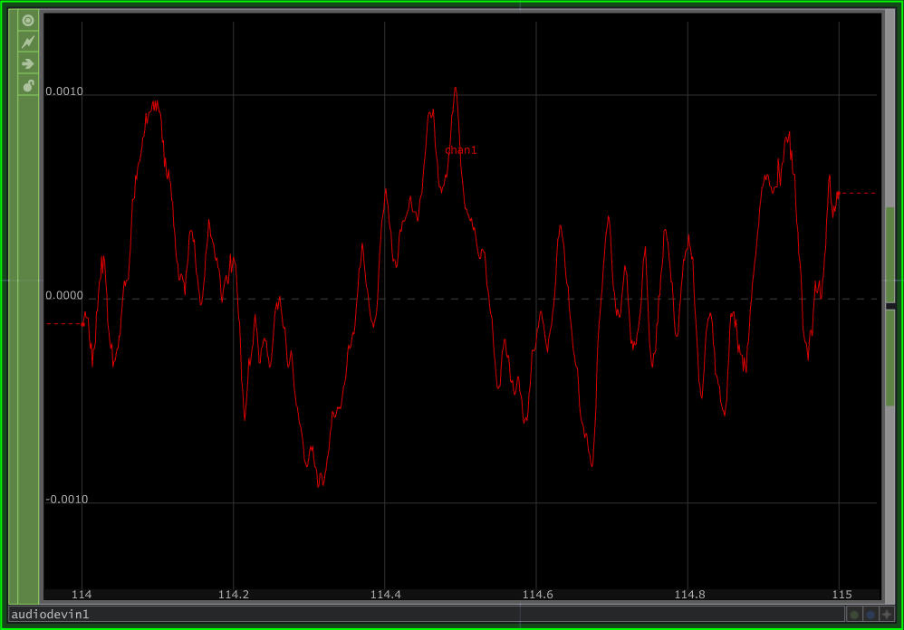
</p>

4. Click on the `Audio Device In` `CHOP` to ensure it's selected.
5. Now headover to the `Parameters` Window on the top-right corner of the TouchDesigner software.<br>
It looks something like this:
<p align="center">
	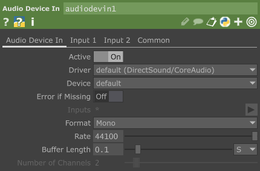
</p><br>

> Note: If you are unable to access this window, hit `P` on the keyboard.

6. Change the `Device` from `default` to `CABLE Output (VB-Audio Virtual Cable)`
<p align="center">
	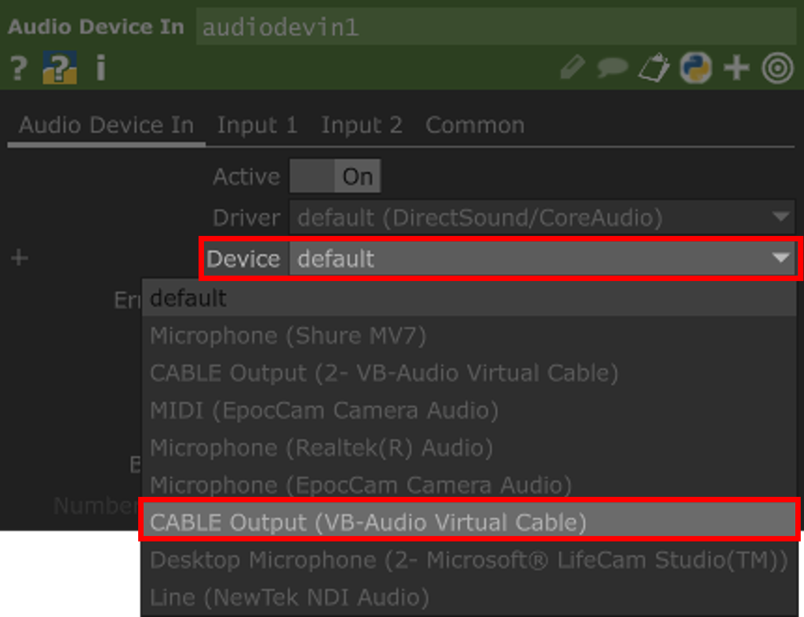
</p>

7. We now need to add an `Audio Device Out` `CHOP`, just the way `Audio Device In` `CHOP` was added.<br>
It looks something like this:
<p align="center">
	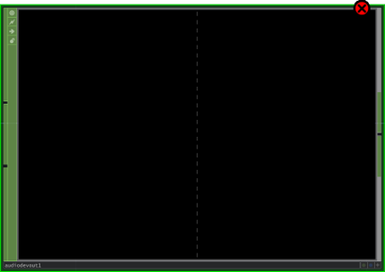
</p>

8. In the `Parameters` window of the `Audio Device Out` `CHOP`, change the `Device` from `default` to your Speakers output, e.g., Audio Card, etc..<br>
In my case, it's `X340 PRO (2-Intel(R) Display Audio)`
<p align="center">
	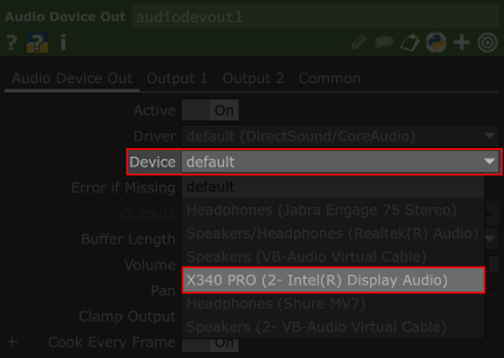
</p>

9. Now, the input and output are configured.<br>
The only missing link is the connection between these two nodes.<br>
We connect the output of `Audio Device In` to the `Input 0` of `Audio Device Output`:
<p align="center">
	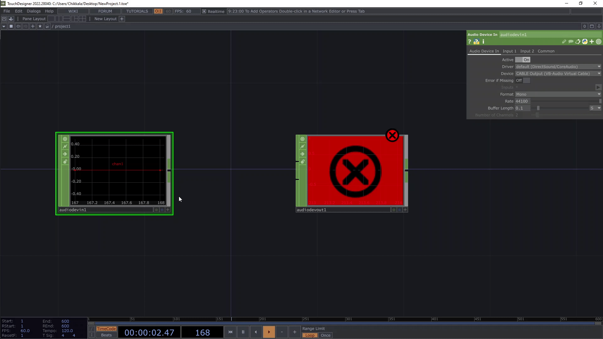
</p>

10. To whether TouchDesigner is able to properly route the audio, play an audio file or a YouTube video from the PC and check whether the audio is audible.

## PSN Setup
1. Add a `PosiStageNet` `CHOP`
<p align="center">
	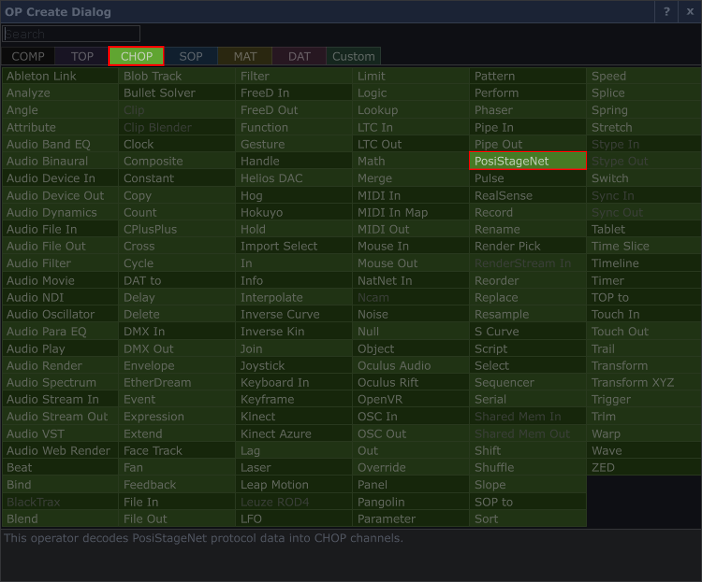
</p><br>
<p align="center">
	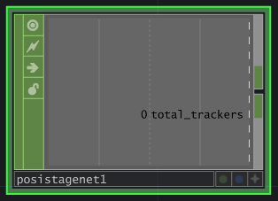
</p>

6. In the `Parameters` window of the `PosiStageNet` `CHOP`, select the `Local Address` to any of the IP Addresses that belong to the network interface that is receiving PSN traffic.<br>
It does not matter which IP Address (in case you have multiple IP Addresses assigned) as PSN is a multicast traffic.<br>
As long as you have the IP Address belonging to the interface is selected, it will work.
<p align="center">
	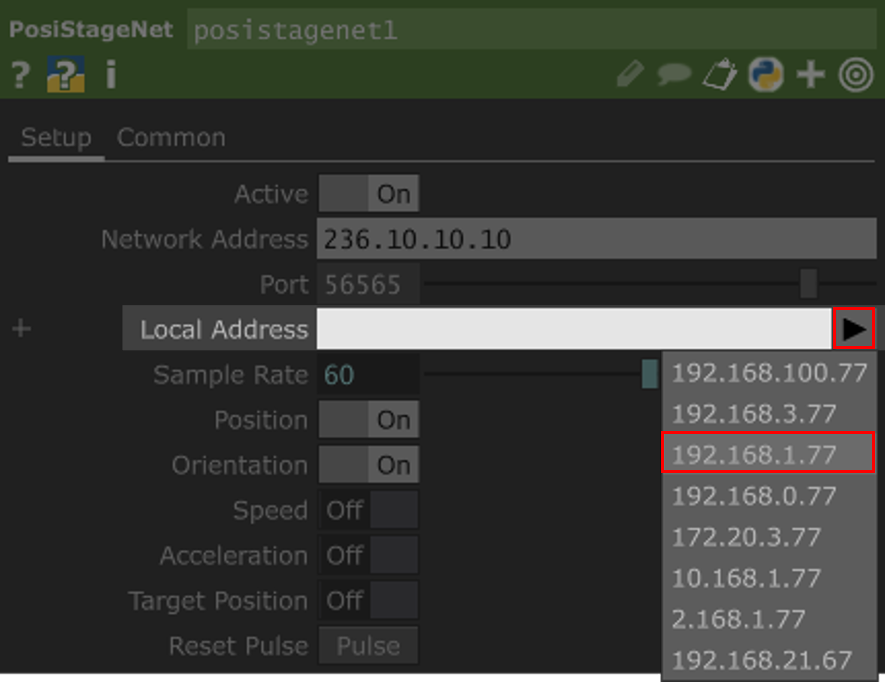
</p>

7. You should now immediately see the tracker information in the `PosiStageNet` `CHOP`.
<p align="center">
	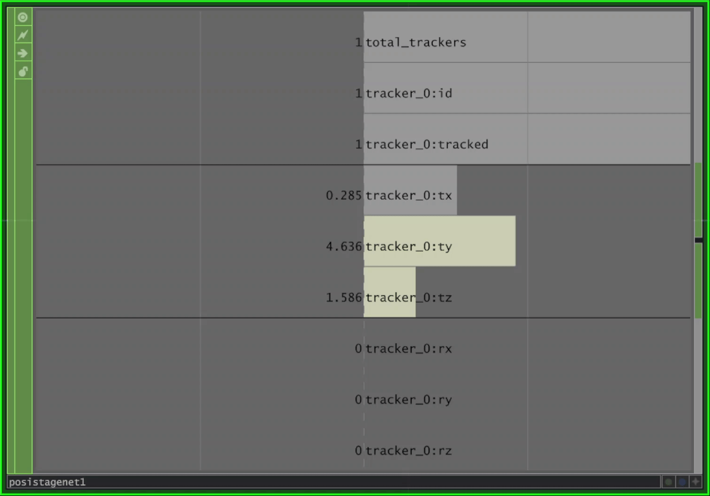
</p>

8. When there is only one tracker, you should see 9 channels as in the picture above.<br>
On the right half of the `PosiStageNet` `CHOP`, you will find the channel ID and on the left, the value of relevant channel.<br>
The channels are as below:
```
┏━━━━━━━━━━━━━━━━━━━━━━━━━━┳━━━━━━━━━━━━━━━━━━━┓
┃          Channel         ┃ TouchDesigner ID  ┃
┣━━━━━━━━━━━━━━━━━━━━━━━━━━╋━━━━━━━━━━━━━━━━━━━┫
┃ Total Amount of Trackers ┃ total_trackers    ┃
┣━━━━━━━━━━━━━━━━━━━━━━━━━━╋━━━━━━━━━━━━━━━━━━━┫
┃ Tracker-1's ID           ┃ tracker_0:id      ┃
┣━━━━━━━━━━━━━━━━━━━━━━━━━━╋━━━━━━━━━━━━━━━━━━━┫
┃ Tracker-1's Status       ┃ tracker_0:tracked ┃
┣━━━━━━━━━━━━━━━━━━━━━━━━━━╋━━━━━━━━━━━━━━━━━━━┫
┃ Tracker-1's Position X   ┃ tracker_0:tx      ┃
┣━━━━━━━━━━━━━━━━━━━━━━━━━━╋━━━━━━━━━━━━━━━━━━━┫
┃ Tracker-1's Position Y   ┃ tracker_0:ty      ┃
┣━━━━━━━━━━━━━━━━━━━━━━━━━━╋━━━━━━━━━━━━━━━━━━━┫
┃ Tracker-1's Position Z   ┃ tracker_0:tz      ┃
┣━━━━━━━━━━━━━━━━━━━━━━━━━━╋━━━━━━━━━━━━━━━━━━━┫
┃ Tracker-1's Rotation X   ┃ tracker_0:rx      ┃
┣━━━━━━━━━━━━━━━━━━━━━━━━━━╋━━━━━━━━━━━━━━━━━━━┫
┃ Tracker-1's Rotation Y   ┃ tracker_0:ry      ┃
┣━━━━━━━━━━━━━━━━━━━━━━━━━━╋━━━━━━━━━━━━━━━━━━━┫
┃ Tracker-1's Rotation Z   ┃ tracker_0:rz      ┃
┗━━━━━━━━━━━━━━━━━━━━━━━━━━┻━━━━━━━━━━━━━━━━━━━┛
```
As new trackers are added, 8 additional channels per tracker will be shown in the `PosiStageNet` `CHOP`.

9. We are only interested in the the tracker's `X` & `Y` position; in the TouchDesigner's language,<br>
`tracker_0:tx`<br>
`tracker_0:ty`

## Connecting Audio & PSN
The `Audio Device Out` `CHOP` has a `Pan` parameter which ranges from `0` to `1`.<br>
`0`, being pan all the way to left.<br>
`1`, being pan all the way to right.<br>
The default value is `0.5`, being pan in the center.

We need to connect zactrack's `x` position from a tracker to this `Pan` parameter.<br>
However, as you can see, zactrack's "`x`" position's value can range far below `0` and above `1` depending on our stage setup.<br>
For this reason, we need to normalise the zactrack's position data to range from `0` to `1`.

1. We do this by using the `Math` `CHOP` in TouchDesinger.<br>
<p align="center">
	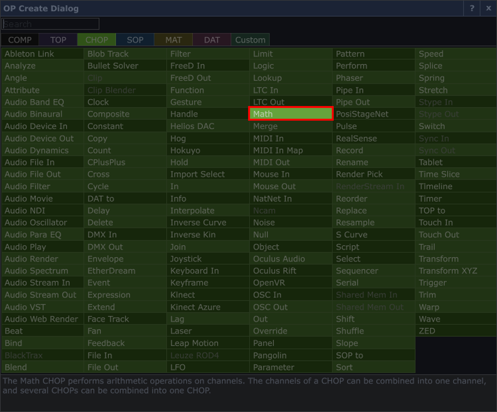&nbsp;&nbsp;&nbsp;&nbsp;
	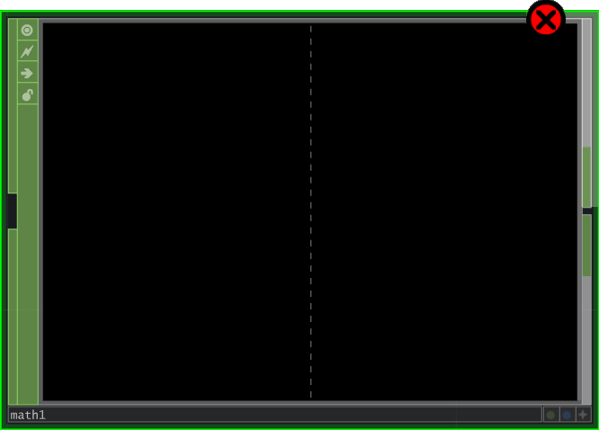
</p>

2. We now connect the `PosiStateNet` `CHOP`'s output to the `Math` `CHOP`.
<p align="center">
	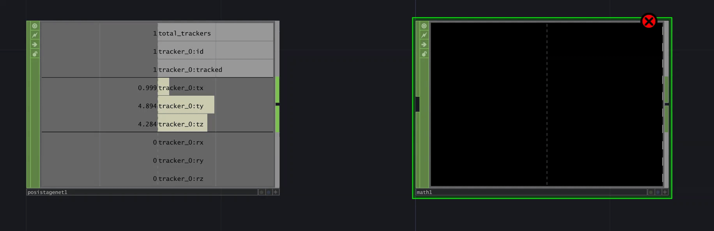
</p>

3. In the `Math` `CHOP`'s, `Parameters` window, click on `Range`.<br>
`From Range`, is for the input's values, for zactrack's PSN's range.<br>
`To Range` is for the output's values, for `Audio Device Out` `CHOP`'s `Pan` range.

4. Place the Actor on the extreme left of your space/stage and take note of the `tracker_0:tx`'s value **from the `PosiStageNet`'s `CHOP`**.<br>
In our testing space the value of the tracker in the extreme left corner is roughly aroung `2.8`.
<p align="center">
	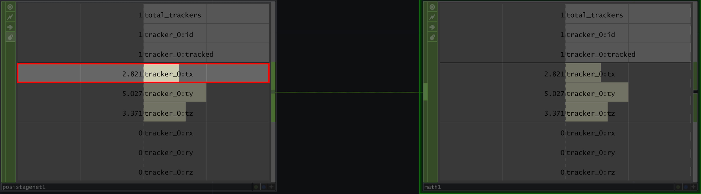
</p>

5. Now, place the Actor on the extreme right of your space/stage and take note of the `tracker_0:tx`'s value, once again, **from the `PosiStageNet`'s `CHOP`**.<br>
In our testing space the value of the tracker in the extreme right corner is roughly aroung `0.2`.
<p align="center">
	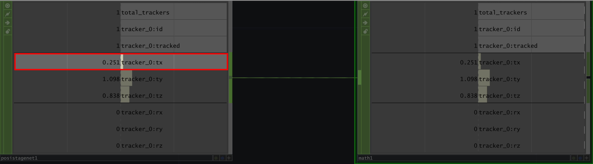
</p>

6. We now need to enter these values (`2.8` & `0.2`, in our test setup's case) in the `Math` `CHOP`'s `From Range` parameters.
<p align="center">
	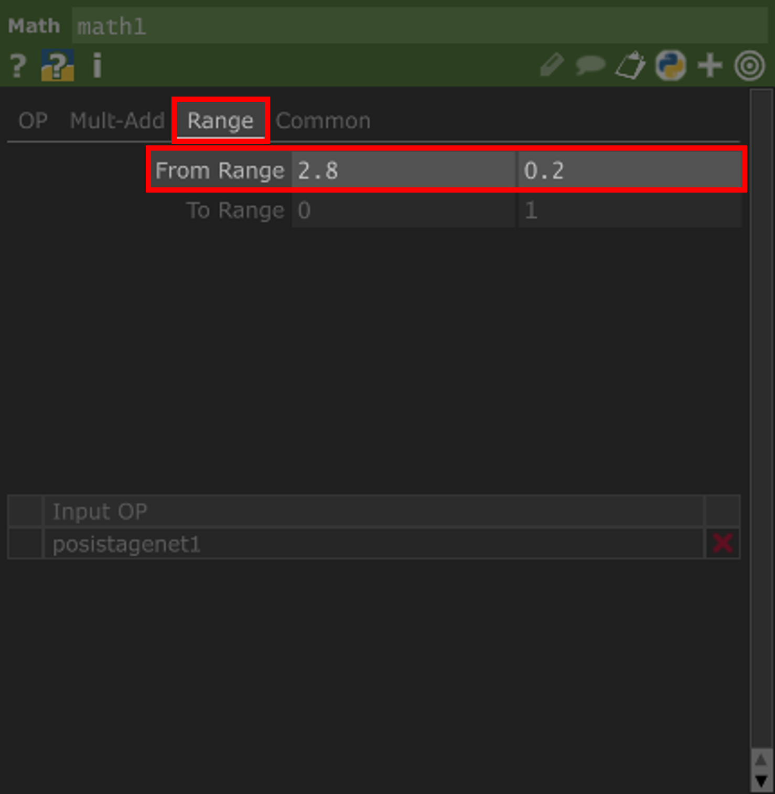
</p>

7. You can now move the tracker from left to right and see that the `Math` `CHOP`'s `tracker_0:tx` value only go from 0 to 1.<br>
This is now ideal for influencing the `Pan` parameter of the `Audio Device Out` `CHOP`.

8. To do this, set the `Math` `CHOP` in `Viewer Active` state by clicking on the **➕** icon at the bottom-right.<br>
This allows us to interact wiht the channels directly.
<p align="center">
	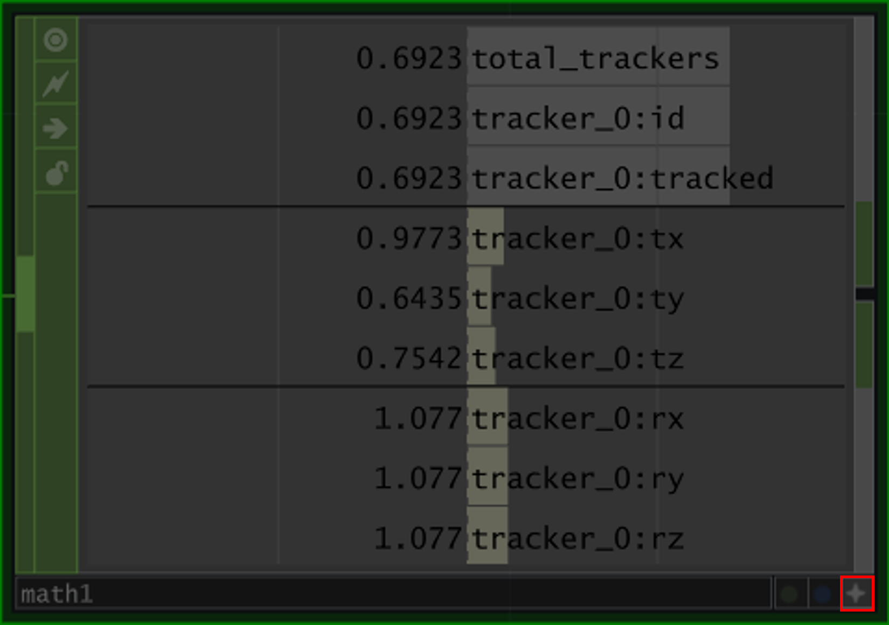
</p>

9. We should now be able to click and hold on the `tracker_0:tx` channel in `Math` `CHOP` and drag it (don't release the mouse yet) over `Audio Device Out` `CHOP`, wait till `Parameter` window switch to `Audio Device Out`'s parameters.<br>
Once the `Parameter` window is set to `Audio Device Out`, drop it on the `Pan` parameter and choose `Export CHOP Reference`.
<p align="center">
	
</p>

Now, as the Actor is moving across the stage, you can hear the Audio panning left & right based on the position of the Actor.