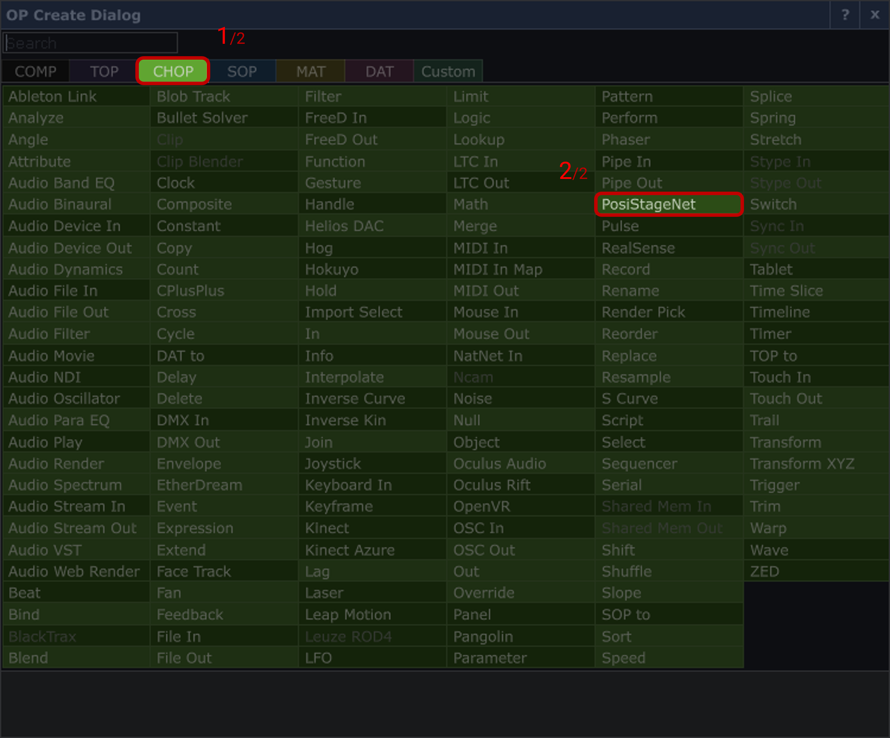

# zactrack :: Audio
**[zacTrack Documentation](../README.md) `>` [zacTrack with Audio](zt_Audio.md)**

# Index
* [Introduction](#introduction)
* [Goal](#goal)
* [Requirements](#requirements)
* [Software Versions](#software-versions)
* [TouchDesigner Setup](#touchdesigner-setup)

# Introduction

TouchDesigner is a node-based software that allows for creating some interaction between several protocols.<br>
It is mainly used for visual interactions but in our case we are going to use it to get the XYZ data provided by zactrack over PSN to modify the PAN & Volume.<br>

# Goal
The idea is to play audio files from PC/Mac and pan the audio left or right based on zactrack's tracker position.

# Requirements
1. zactrack System
2. PC or Mac running [TouchDesigner](https://derivative.ca/UserGuide/Install_TouchDesigner).
3. [Virtual VB Audio Cable (for Windows only)](https://vb-audio.com/Cable/#:~:text=%C2%A0%C2%A0VBCABLE_Driver_Pack43.zip%0A%C2%A0%C2%A0(1.09%20MB%20%2D%20OCT%202015%20/%20XP%20to%20WIN11%2032/64%20bits))
4. `<macOS equivalent software here>` (for macOS only)
5. Stereo System
6. Audio Card (optional to connect Speakers to the PC/Mac)

# Software Versions
```
• zactrack      | v3.19.3.0
• TouchDesigner | v2022.28040
• Windows 10    | 21H1, Build: 19043.1889
• macOS         | <macos_version>
```

# TouchDesigner Setup
If you are using TouchDesigner `v2022.26590` or older, follow the guide [here](TouchDesigner_Setup_v2022.26590.md) to do the initial setup.
If you are using TouchDesigner `v2022.28040` or newer, proceed to the following steps.
1. Open TouchDesigner.<br>
It comes with some existing nodes, but we take a new file.
2. `File` → `New`<br>
The application will restart and we will have a new project.
3. We will first need to ensure that the Audio is being routed through TouchDesigner.<br>
Usually, the Audio Routing in our PC is something like this:
<p align="center">
	
</p>
We now need to route it via TouchDesigner and it would look something like this:<br>
<p align="center">
	
</p>

4. To achieve this, we will now add a new operator (aka 'node'):<br>
double-clicking on the empty grid area (we call this area as *Network Editor*)<br>
or<br>
hit `Tab` on the keyboard<br>
or<br>
right-click and and select `Add Operator`.
5. Head over to the `CHOP` tab and select `Audio Device In`.
<p align="center">
	
</p>

6. This should then add an Audio Device In CHOP on our Network Editor ("grid").<br>
It would look something like this:
<p align="center">
	
</p>

7. Click on the `Audio Device In` `CHOP` to ensure it's selected.
8. Now headover to the `Parameter` Window on the top-right corner of the TouchDesigner software.<br>
It looks something like this:
<p align="center">
	
</p><br>

> Note: If you are unable to access this window, hit `P` on the keyboard.

9. Change the `Device` from `default` to `CABLE Output (VB-Audio Virtual Cable)`
<p align="center">
	
</p>

10. We now need to add an `Audio Device Out` `CHOP`, just the way `Audio Device In` `CHOP` was added.<br>
It looks something like this:
<p align="center">
	
</p>

11. In the `Parameter` window of the `Audio Device Out` `CHOP`, change the `Device` from `default` to your Speakers output, e.g., Audio Card, etc..<br>
In my case, it's `X340 PRO (2-Intel(R) Display Audio)`
<p align="center">
	
</p>

12. Now, the input and output are configured.<br>
The only missing link is the connection between these two nodes.<br>
We connect the output of `Audio Device In` to the `Input 0` of `Audio Device Output`:
<p align="center">
	
</p>


7. In the similar manner, proceed to add an `Audio Device Out` `CHOP`.
8. And your Network Editor should now look something like this:

5. Head over to the `CHOP` tab and select `PosiStageNet`.
<p align="center">
	
</p><br>
It should look something like this:
<p align="center">
	
</p>

6. Select the PosiStageNet node and in the `Properties` pane of the node, ensure you have the following options set.
<p align="center">
	
</p>