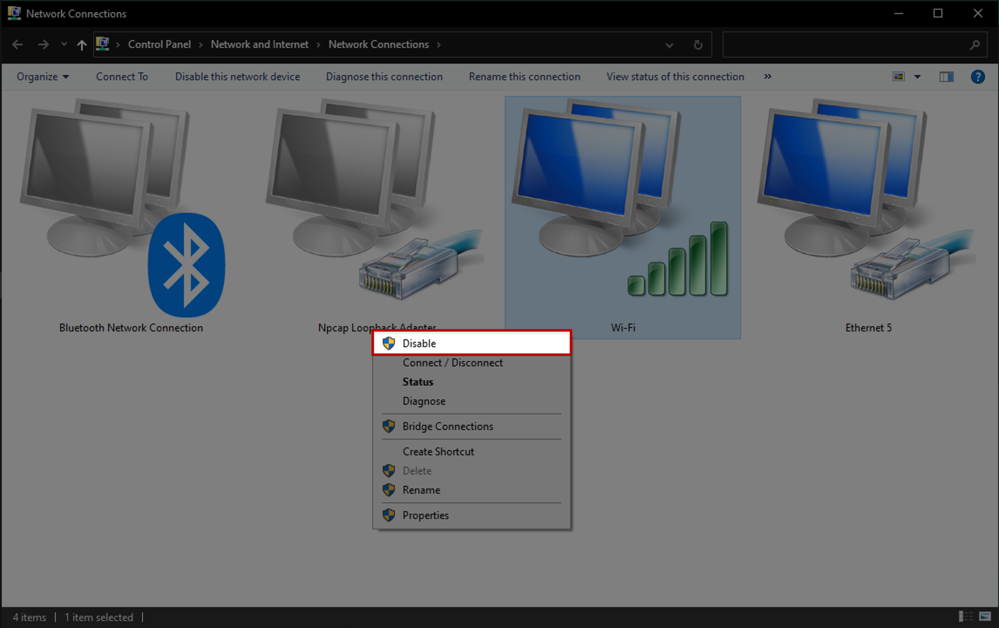

# zactrack :: Audio
**[zacTrack Documentation](../README.md) `>` [zacTrack with Audio](zt_Audio.md)**

# Introduction

TouchDesigner is a node-based software that allows for creating some interaction between several protocols. It is mainly used for visual interactions but in our case we are going to use it to get the XYZ data provided by zactrack over PSN to modify the PAN & Volume.

# Software Versions
```
• zactrack      | 'v3.19.3.0'
• TouchDesigner | 'v2022.26590'
• Windows 10    | '21H1, Build: 19043.1889'
• macOS         | <macos_version>
```

# Requirements
1. zactrack System
2. PC or Mac running [TouchDesigner](https://derivative.ca/UserGuide/Install_TouchDesigner).
3. Stereo System

# TouchDesigner Setup (Win10)
At the time of writing this article, it is not possible yet to select a specific Network Adapter of your PC to choose to listen for PSN traffic in TouchDesigner.<br>
This is clearly a TouchDesigner's limitation<br>
However, the developers of TouchDesigner are [confident to fix this with version `2002.27000+`](resources/PSN_CHOP_Interface_dev_comment.png); [Link to Touch Designer Forum](https://forum.derivative.ca/t/posinet-chop-artnet-cant-receive-data-simultaneous/150683/9?u=lukechikkala)<br>
For this reason, we need to disable all Network Interfaces except the one we are expecting the PSN traffic from.
1. To do this, open `Network Connections` by clicking on Start (Windows Icon) and type `View Network Connections`.
<p align="center">
    
</p>

2. Here, select the network interface that is not expected to receive PSN traffic, right-click and choose `Disable`.
Do this for all the network interfaces except for the one that is expected to receive PSN traffic.
3. Now, we open TouchDesigner
It comes with some existing nodes, but we take a new file.
4. `File` → `New`
The application will restart and we will have a new project.
5. We will first need to ensure that the Audio is being routed through TouchDesigner.
Usually, the Audio Routing in our PC is something like this:
<p align="center">
    
</p><br>
We now need to route it via TouchDesigner and it would look something like this:<br>
<p align="center">
    
</p>

6. To achieve this, we will now add a new operator (aka ‘node’) either by double-clicking or by hitting `Tab` on the keyboard or by right-clicking on the empty grid area (we call this area as Network Editor) and selecting `Add Operator`.
7. Head over to the `CHOP` tab and select `PosiStageNet`.
<p align="center">
    
</p><br>
It should look something like this:
<p align="center">
    
</p>

8. Select the PosiStageNet node and in the `Properties` pane of the node, ensure you have the following options set.
<p align="center">
    
</p>
