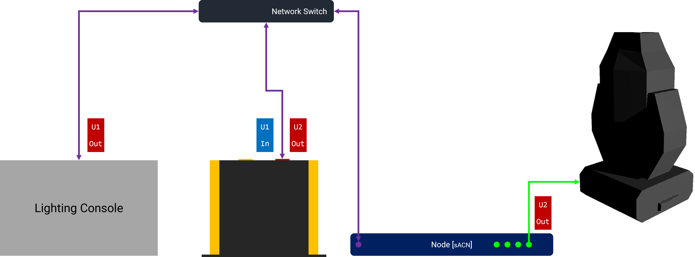
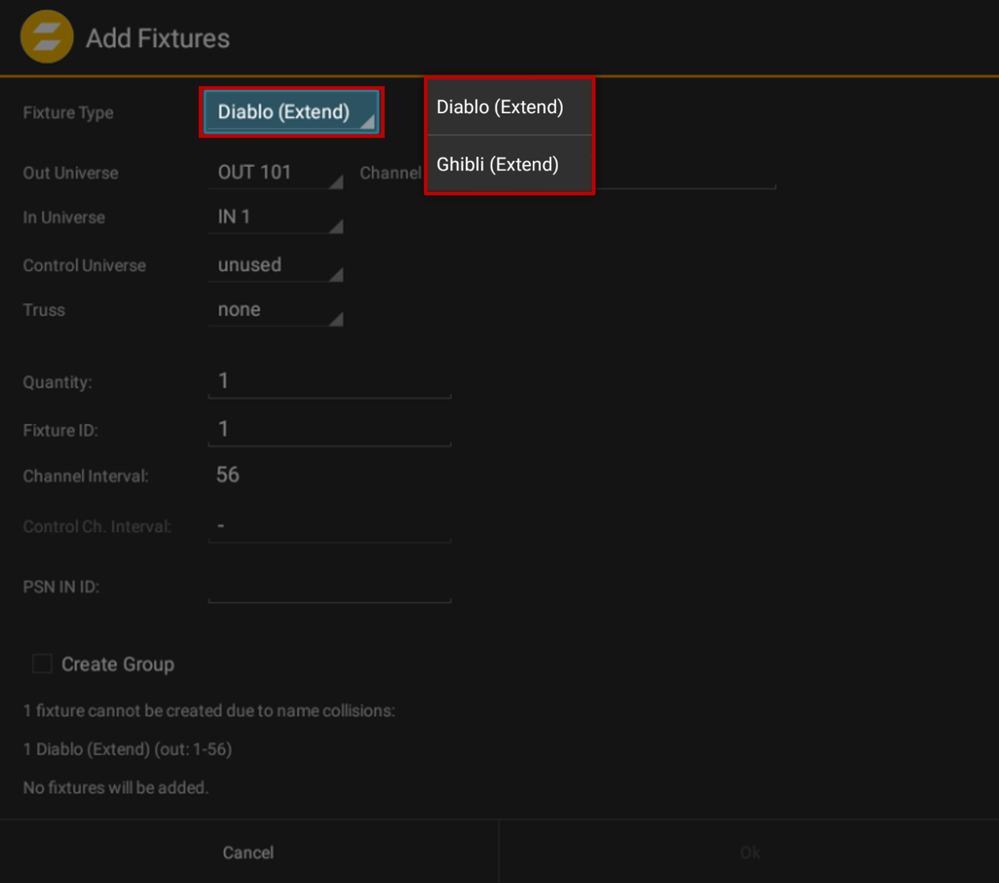
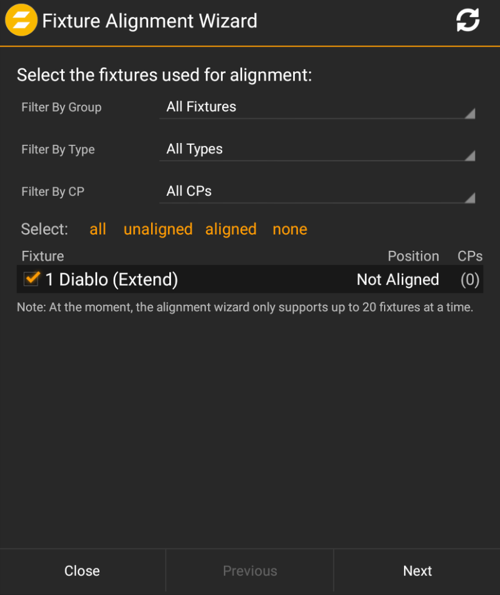
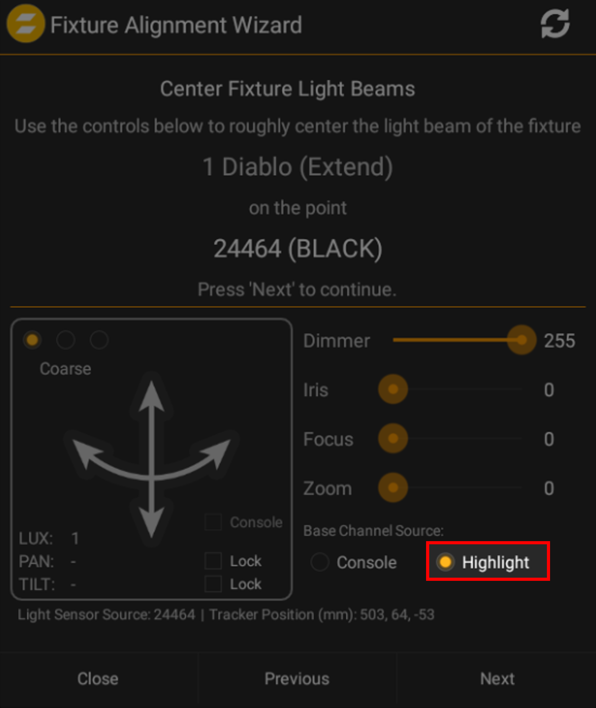
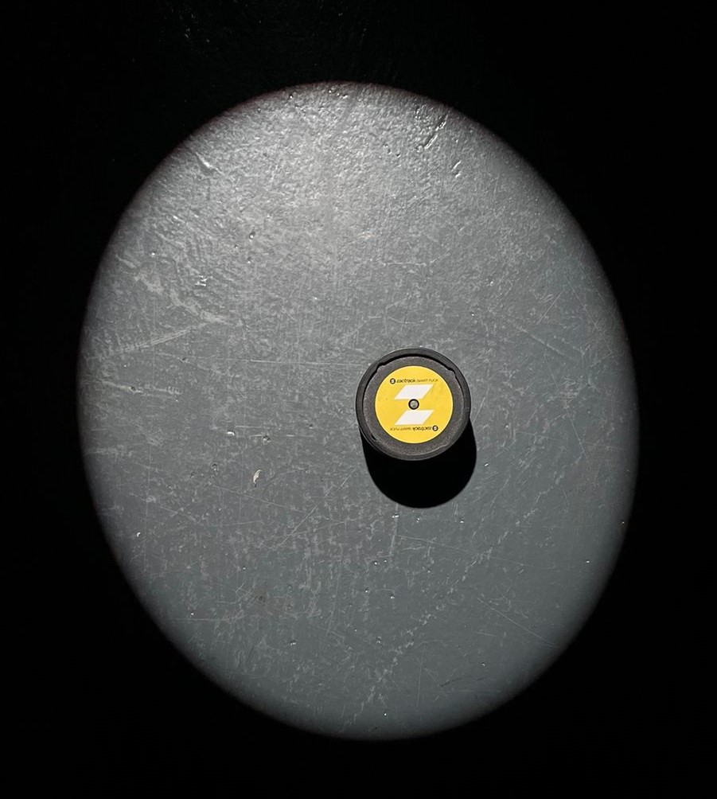
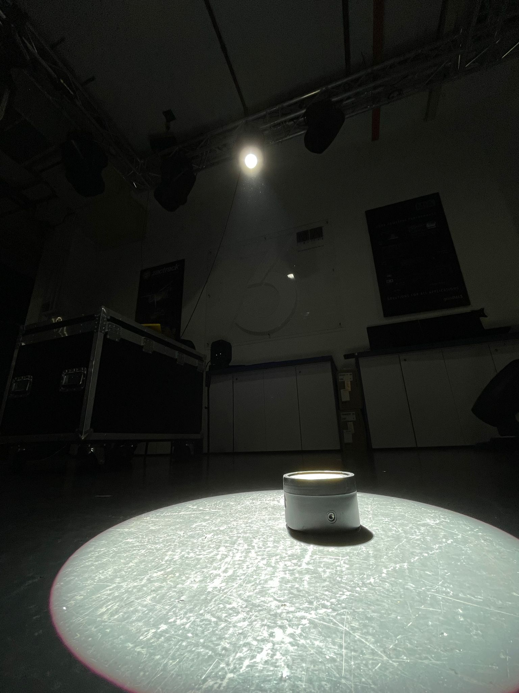
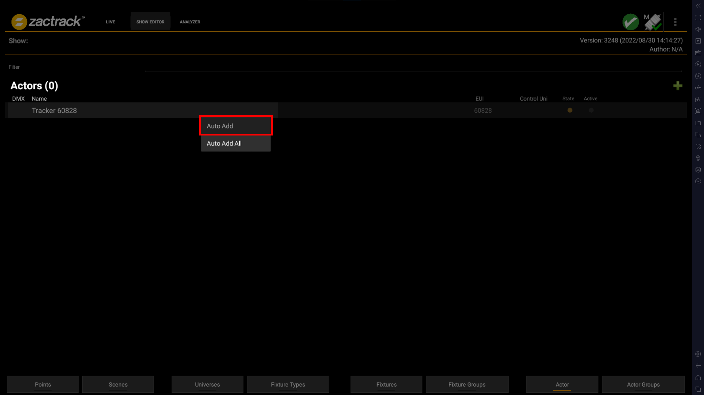

# Control using Console
**[zacTrack Documentation](../README.md) `>` [zacTrack with Lighting](zacTrack_with_Lighting.md) `>` [Control Using Console](zt_Lighting_Console.md)**

In this setup, we will be adding a console to have simultaneous control of fixtures.
This documentation assumes the system is already calibrated.
To know more about System Calibration, visit [here](https://www.notion.so/ZacTrack-System-Setup-c47b222265f24c6eb2d33da085d5d04c).

# ZacTrack Fixture Setup

### Add Fixtures to ZacTrack

1. Click on the `⋮` on the top-right corner, followed by `New Show` and chose Empty Show.
2. Follow the [zacTrack System Setup](https://www.notion.so/ZacTrack-System-Setup-c47b222265f24c6eb2d33da085d5d04c) notes to setup the system.
3. Go to `Show Editor` → `Fixture Types` and click on the green **➕ icon.**
4. Here, zacTrack shows a list of built-in Fixtures.
Choose one from here or create a new custom fixture type by following the [Fixture Builder guide](https://www.notion.so/ZacTrack-Fixture-Builder-Guide-9203e4c93e4d49e792c04c0b32fa4d12).
5. Perform a `Show Upload` by clicking on the alert icon on the top-right corner of the screen and choosing `Upload to Server`.
6. Then, head over to `Show Editor` → `Fixtures` and add the fixture you added into the show by clicking on the green plus icon [**➕**] .
    
    
    
7. Click on `Fixture Type` and choose the fixture you added.
8. Set `Out Universe` to `OUT 101` and click on `OK`.
9. Set `In Universe` to `In 1`.
10. Perform `Show Upload`.
11. In `Show Editor` → `Fixtures`, select the target icon (under `CP/AF` column) next to fixture to check whether the fixture itself is controllable from ZacTrack.
12. This will popup a window showing the basic fixture controls like `Dimmer`, `Iris`, `Focus`, `Zoom`, `Pan` & `Tilt`. where it allows you to manually control the fixture for testing purposes.
To check the fixture, ensure `Highlight Base Channels` is enabled.

## Teaching ZacTrack placement of Fixtures in the Real World

1. Once the fixture control is working manually, close the popup and head over to `Show Editor` → `Fixtures` and click on `Alignment Wizard`.
2. Select fixtures that we are you want to align and press `Next`.

    
    
    
3. Ensure Use `Console for Centering` and `Advanced Mode` are both set to `no` and click `Next`.
    
    
    
4. Ensure `Highlight` is toggled on.
    
    
    
5. Set `Dimmer` to `255` and use the Track Pad to point the fixture at Black Puck.
It doesn’t have to be in the center but as long as the beam is fairly falling on the black puck, it will be fine. See below pictures for reference.
    
    
    

1. We then click on `Next` to continue to do the same for Red, Green & Blue pucks.
2. At the end, ZacTrack will now start the refinement process trying to find the center of the beam.
This will help ZacTrack to figure out where the fixture is in the 3D space. During the Refinement Process, it is also possible to adjust the `Resolution`, the default for which is `8 Ticks`.
The lower the ticks, the more time it takes to Refine but gives a much more precise location of the fixture in the 3D space.

1. Once the Refinement Process is finished, you would see a screen like this:

1. Perform `Show Upload`.

## Adding Actors

1. We now need to add the Trackers by going to `Show Editor` → `Actor`.
2. Dismount one of the Trackers from the Charging Station and it will show up in the `Actor` window.
This might take a second or two.
3. Once the Tracker shows up, press and hold on the shown Tracker and select `Auto Add`.
    
    
    
    Adding Trackers to Actors
    
4. The name of the `Tracker xxxxxx` now changes to `Actor 01`.
5. Perform `Show Upload`.
6. Go to `Live`, select your Fixture, disable `Console` next to `Assignment` option and set `Assignment` to `Actor 01 (1)`.
7. To switch on the Dimmer, set the `Base Channel Values` from `Console` to `Highlight`.