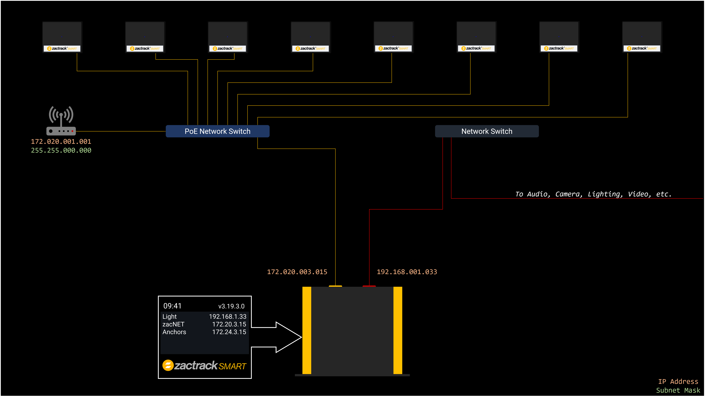
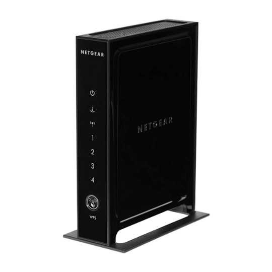
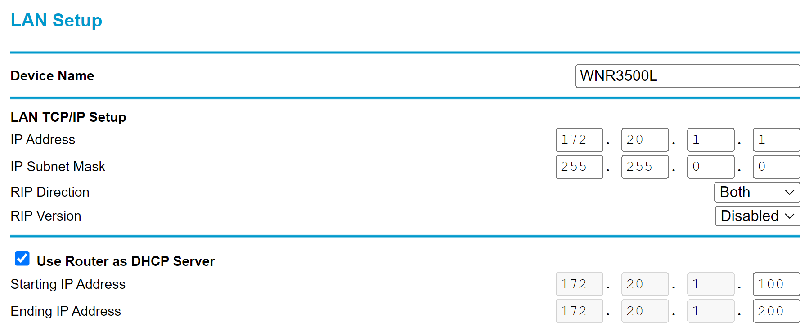
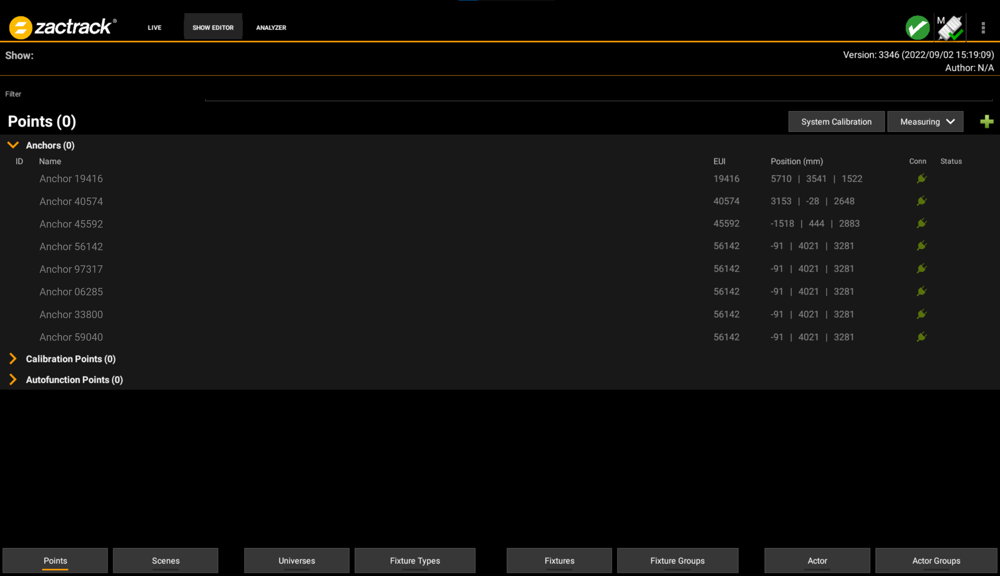
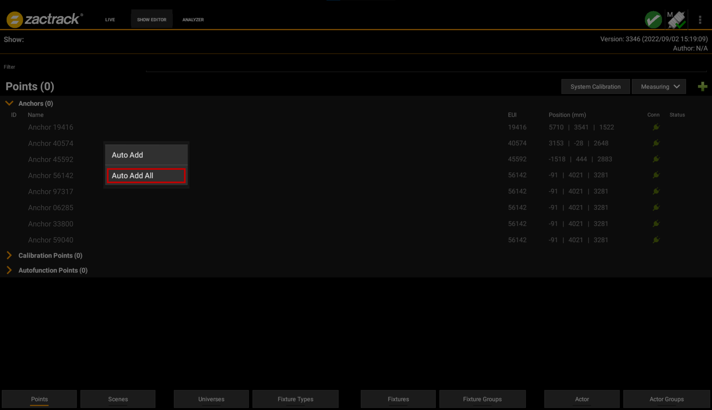
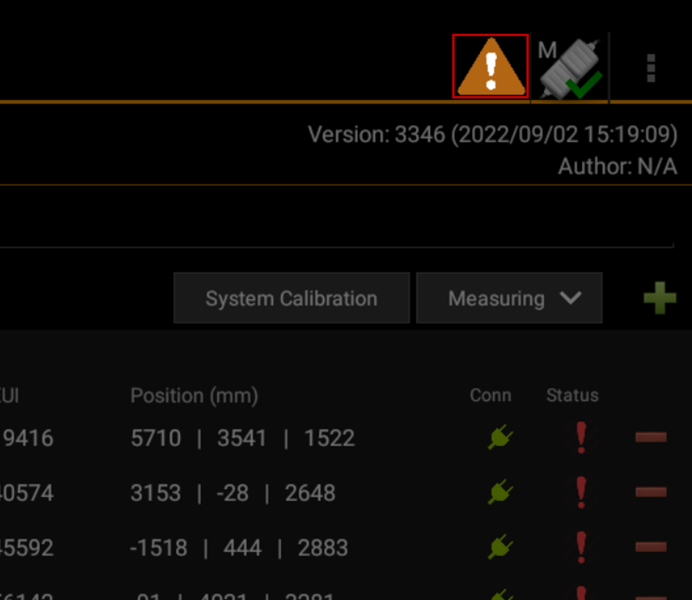
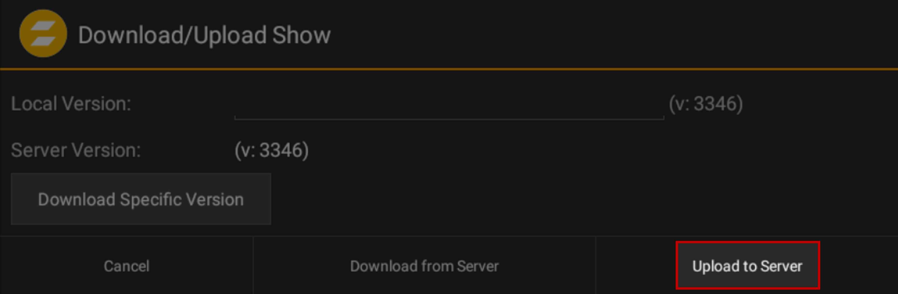

# zactrack System Setup
**[zacTrack Documentation](../README.md) `>` [zacTrack System Setup](zt_Setup.md)**


# Index
* [Requirements](#requirements)
* [Network Setup](#network-setup)
	* [Layout](#layout)
	* [Setting up Wi-Fi Router](#setting-up-wi-fi-router)
	* [Download zactrack app](#download-zactrack-app)
* [Mounting](#mounting)
	* [Preperation](#preparation)
	* [Adding Anchors in zactrack App](#adding-anchors-in-zactrack-app)
* [Calibration](#calibration)

# Requirements
```
1 x zactrack SMART Server running v3.19.2.0
8 x Anchors
4 x Pucks
1 x Tracker [optionally more]

1 x 10-Port PoE Network Switch
1 x  4-Port Network Switch
1 x Wi-Fi Router (or) Access Point

8 x 15m Cat5 (or above) Ethernet Cables
7 x  5m Cat5 (or above) Ethernet Cables [optionally more]
1 x Andoid Tablet or PC with 'BlueStacks 5' installed; link to 'BlueStacks 5' below
```
[Download Bluestacks](https://www.bluestacks.com/)

# Network Setup
## Layout
Here below you will find the network setup of the 
<p align="center">
	
</p>

## Setting up Wi-Fi Router
This documentation was built using `Netgear WNR3500L`<br>
But, virtually any basic home router would still work depending on the space you are trying to cover.<br>
<p align="center">
    
</p>

The most important configuration you would do here is to ensure that the DHCP range of the Wi-Fi router and the zactrack server are with in the same subnet (range).<br>
The IP Address of the server used for this documentation is `172.20.3.15`.<br>
Hence, we set the DHCP range of our Wi-Fi router to be around this range, say, `172.20.1.100` ~ `172.20.1.200` and the `IP Subnet Mask` to be `255.255.0.0`.<br>
Here below is a picture to show you the settings on the web configuration page of the router.<br>
<p align="center">
    
</p>

## Summary (for reference only)

|					 |					|
|:-------------------|:-----------------|
|`SSID				`|`zactrack`		|
|`Password			`|`password@123`	|
|`Encryption		`|`WPA2-AES`		|
|`Router IP			`|`172.20.1.1`		|
|`IP Subnet Mask	`|`255.255.0.0`		|
|`DHCP Server		`|`Enabled`			|
|`DHCP IP Start		`|`172.20.1.100`	|
|`DHCP IP End		`|`172.20.1.200`	|


## Download zactrack app
1. The zactrack app is not available for download from the Play Store.<br>
But the Android application can be downloaded from the server itself.
2. Connect the Android tablet to the same network as the zactrack server.
3. Follow the video guide here below:

https://user-images.githubusercontent.com/23566967/188103940-23f01f4d-5feb-4cf3-8828-983f7c79efad.mp4

4. If the video fails to load, follow the below steps.
5. Open a web browser on the Android tablet.
6. Type the IP Address of the zactrak server in the web browser.
7. It should then show the following page:
<p align="center">
    
</p>

8. Here, click on `Tablet Applications`.
9. Download the `zactrack-client_x.y.z.apk` file.
10. Once downloaded, install and open the application.

# Mounting
## Preparation

> **Note**<br>
The **MOST** ideal way of calibrating the Anchors would be to have an empty space.<br>
Once the calibration is finished, the stage elements (like props, etc.) can be filled on the stage.

1. Place 4 Anchors at 1.5 ~ 2.0 meters, assymetrically.
2. Place 4 Anchors at 3.0 ~ 4.0 meters, assymetrically.
> **Note**<br>
The anchors cannot be farther than 30 meters between each other.
3. Ensure the Anchors are placed at least 0.5 meters away from any reflective surfaces (like walls, etc.).<br>
<p align="center">
    
</p>

4. Ensure that the Anchors are placed only in landscape mode; either 0° or 180° flat.<br>
<p align="center">
    
</p>

5. Ensure that the Anchors are not inclined down or up.
6. Ensure that all the Anchors have line-of-sight to the pucks (we will place them in the coming steps) or trackers.
7. Switch the Pucks ON (power button at the bottom) and ensure it's blinking blue.
8. Place the 4 Pucks on the stage (~3m apart from each other) in an approximate square/rectangle shape.<br>
They do not need to be in a perfect shape.
<p align="center">
    
</p>

9. Ensure that the axes (X, Y & Z axis) are properly aligned.
```
Black   : Origin
Red     : X-Axis [Along Stage Left]
Green   : Y-Axis [Along Up Stage]
Blue	: Custom []
```

10. Ensure the stage is empty.

## Adding Anchors in zactrack App
1. Open the zactrack app on the Android Tablet.
2. Tap on the `⋮` on the top-right corner, followed by `New Show` and chose Empty Show.
3. Go to `Show Editor` → `Points`.
4. Ensure all 8 Anchors are detectable here.<br>
<p align="center">
    
</p>

5. Tap & hold on one of the Anchors and select `Auto Add All`<br>
<p align="center">
    
</p>

6. Perform a `Show Upload` by clicking on the alert icon on the top-right corner of the screen and choosing `Upload to Server`.<br>
<p align="center">
    
</p><br>
<p align="center">
    
</p>

# Calibration
1. Go to `Show Editor` → `Points`.
2. Tap on `System Calibration`
3. Select `Reinitialize System (Auto)` → `Next`.
<p align="center">
    
</p>

4. zactrack App will now show the 8 anchors again; to emphasize the anchors it's calibrating.
<p align="center">
    
</p>

5. Tap on `Next`.
6. Ensure `Advanced Mode` is set to `No` and that the `4/4 Trackers Online` is visible next to it.
<p align="center">
    
</p>

7. Tap on `Next`; here it shows a short guide of Puck placements.
8. Proceed to the last step and it should now show the following screen:<br>
<p align="center">
    
</p>
At this point, zactrack is algorithmically preparing to create a virtual mesh.<br>
<p align="center">
    
</p>

9. After several hundreds of iterations, it should calibrate the virtual space to match the real-world.<br>
There should not be more than 2 attempts.<br>
If the line-of-sight is extremely clear, the system will even skip the **Calibration Progress** screen.<br>
<p align="center">
	
</p>

10. Proceed to the next steps only if the `Calibration Result` is shown as `Good`.<br>
If not, move the pucks and ensure the line-of-sight is extremely clear and try the calibration process once again.

<p align="center">
    
</p>

11. Perform `Show Upload`.
